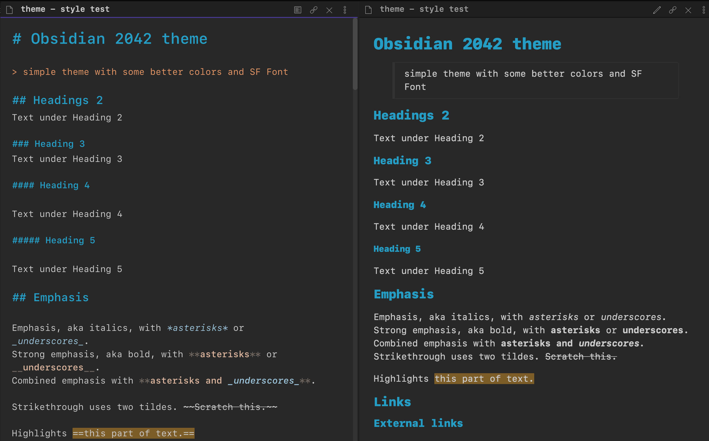

# 2042 dark theme for Obsidian.md

A minimal dark theme for [Obsidian](https://obsidian.md/).
I wanted just to change main colors, font and editor width, so to keep the theme as much as possibile compatibile with Obsidian evolution.

## Install

1. Download the `obsidian.css` file.
2. In Obsidian click Settings->Appearance and turn on `Apply Custom CSS`.
3. Put the `obsidian.css` in your vault root folder.
4. Restart Obsidian.

Note: _The theme font Menlo, but you can change easily_

### Test
I use this [markdown test file](test.md) to check

